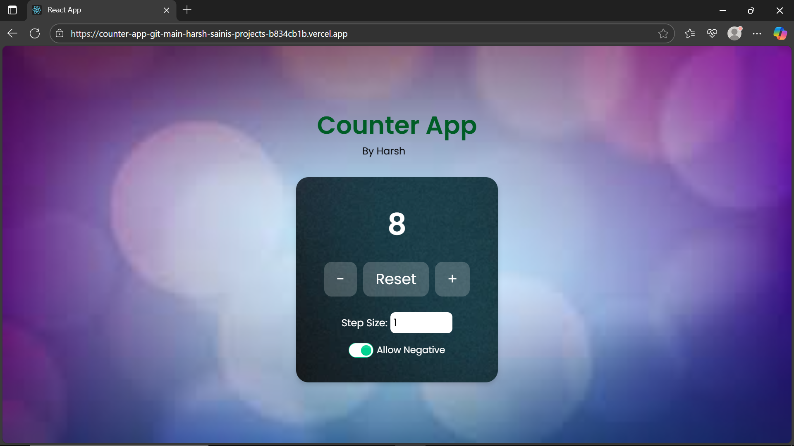

Counter App
📌 Project Title & Objective

Counter App – A simple and interactive React application that allows users to increment, decrement, and reset a counter value with custom step size and validation rules.

📄 Description

This project is a React-based Counter App built to practice fundamental concepts of React such as state management, event handling, conditional rendering, and dynamic styling.

The app includes:

✔️ Increment / Decrement counter

✔️ Reset functionality

✔️ Step size adjustment

✔️ Option to allow or restrict negative values

✔️ Upper and lower limit handling

🔗 Links

* GitHub Repository: [Counter App](https://github.com/Harsh-Builds/Counter-App)

* Live Demo: [🌐 View Demo Here](https://counter-app-git-main-harsh-sainis-projects-b834cb1b.vercel.app/)

🛠 Technologies Used

- React.js

- JavaScript (ES6+)

- HTML5

- CSS3 / TailwindCSS

⚙️ How to Run the App Locally

Clone the repository:

git clone https://github.com/Harsh-Builds/Counter-App
cd counter-app

Install dependencies:

npm install

Start the development server:

npm start

Open in your browser:

http://localhost:3000

🧪 Sample Input & Output

- Increment Button (+): Increases counter by selected step size

- Decrement Button (-): Decreases counter unless limit/negative restriction is reached

- Reset Button: Resets counter to zero

- Step Size Input: Changes increment/decrement step value

- Allow Negative Checkbox: Controls whether counter can go below 0

- Upper/Lower Limit: Disables buttons if limit is reached

🔧 Features

✅ Increment, decrement, reset functionality
✅ User-defined step size
✅ Restrict/allow negative values
✅ Upper and lower counter limits

📸 Screenshots

🧩 Challenges Faced & Solutions

Challenge: Handling negative values and restricting limits
Solution: Used conditional checks before updating state

Challenge: Understanding state updates
Solution: Practiced with multiple useState hooks and debugging

✨ Author: Harsh Saini
